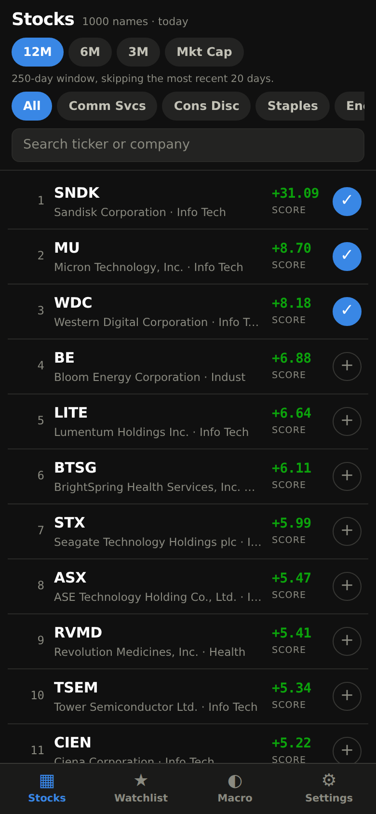
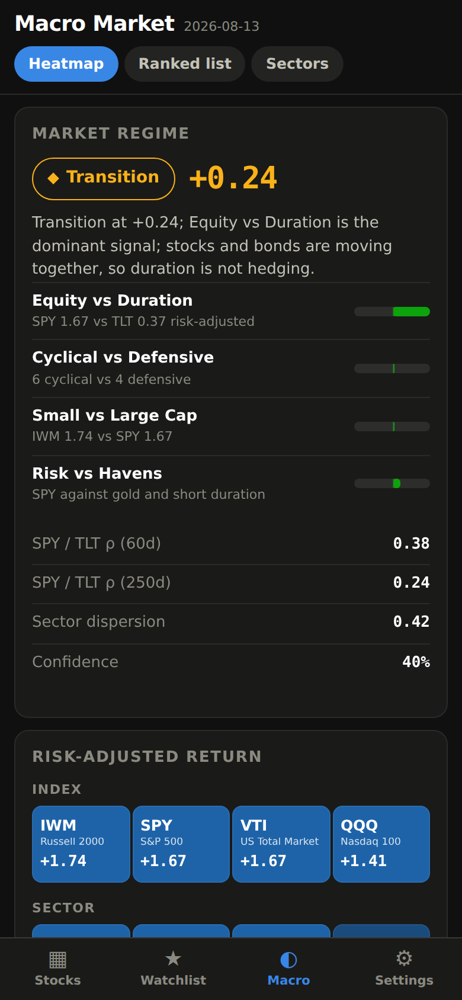
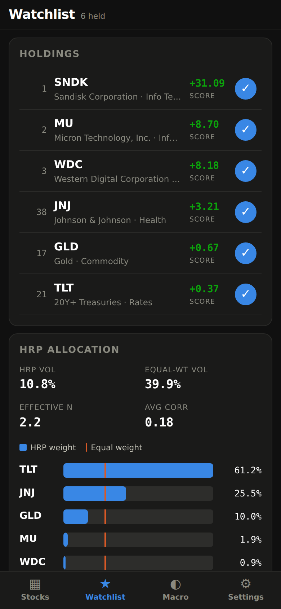

# Biggie

A phone-first stock ranking and macro market intelligence app. It maintains a live
1,000-name equity universe, ranks it on risk-adjusted momentum with a shrunk covariance
model, and reads the cross-asset tape for a risk-on / risk-off regime call.

This is **not a backtester**. Every portfolio is a standing analytical claim that is
re-derived from current data on each refresh.

  

## How it is deployed

The production system is a **scheduled job plus a static site** - there is no server to
keep running:

```
GitHub Actions (after each close) -> FMP -> analytics -> validate -> static site -> Pages -> iPhone
```

`.github/workflows/daily.yml` runs at 01:30 UTC Tue-Sat (weekday evenings in US Eastern),
tops up the cached price history, rebuilds every analytic, validates the result, and
publishes. **A build that fails validation is never deployed**, so the previous good
dataset stays live. The UI shows the date of the data it is serving.

The API key lives only in the `FMP_API_KEY` Actions secret. It is used in the refresh
step and nowhere else: `build_site.py` reads the finished snapshot, so the key cannot
reach the published output. `scripts/check_no_secrets.py` runs in CI and fails the build
if a credential appears in the repo or the built site.

## Running it locally

```bash
python3 -m venv .venv && .venv/bin/pip install -r requirements.txt

export FMP_API_KEY=your_key             # or API_KEY
.venv/bin/python scripts/refresh.py     # build a snapshot (~5min cold, ~15s warm)
.venv/bin/python scripts/build_site.py -o site
(cd site && python3 -m http.server 8000)
```

There is also a FastAPI server for development, which serves the same analytics from a
live process instead of static files:

```bash
.venv/bin/python -m uvicorn app.api:app --app-dir backend --port 8000
```

```bash
.venv/bin/python -m pytest tests/ -q       # 81 tests, no network required
node scripts/smoke_test.js http://127.0.0.1:8000/   # renders the built site
.venv/bin/python scripts/check_no_secrets.py
```

## How it works

### Universe (`universe.py`)

Screens all actively-traded NASDAQ / NYSE / AMEX common equity above $300M market cap,
then takes the largest 1,000 by market capitalisation.

Structurally unsuitable instruments are removed, because they do not behave like equity
and would corrupt both the ranking and the covariance matrix:

| Removed | How it is detected |
|---|---|
| Preferred shares | `-P<letter>` ticker suffix (`FITB-PA`), or "preferred"/"pfd" in the name |
| Baby bonds, trust preferreds | "notes", "debenture", "due 2032", a `%` coupon in the name |
| Warrants / rights / units | `-WT`, `-RT`, `-UN`, `-U` suffixes, or the words in the name |
| ETNs, structured notes, CEFs | `isEtf`/`isFund` flags plus fund-name patterns |
| OTC / pink sheets | Not on a major listing venue |

Bare single-letter suffixes are deliberately **kept** — `BRK-A`, `BF-B` and `MOG-A` are
real common shares, and a naive "strip anything after a hyphen" rule would drop
Berkshire.

Dual-class listings are then collapsed to one line per issuer (GOOG/GOOGL, FOX/FOXA,
BRK-A/BRK-B), keeping the most liquid class. Both the normalised issuer name *and* the
ticker root must agree before two rows merge, so unrelated companies are never silently
dropped. Without this, one company would occupy two slots and double-count its risk.

US-listed foreign issuers and ADRs are kept — they trade on the same venues with the
same data quality.

### Risk model (`risk.py`)

With ~250 observations and 1,000 names the sample covariance matrix is singular and its
extreme eigenvalues are noise, so **Ledoit-Wolf shrinkage** is used throughout (measured
intensity ≈ 0.26 at full universe size). This is what makes HRP, portfolio volatility and
clustering stable rather than artefacts of estimation error.

**What the covariance matrix is not used for.** For a single asset, `sqrt(eᵢᵀ Σ eᵢ)` is
simply that asset's own volatility - shrinkage nudges it, but it is not a second
measurement, and an earlier version of this system wrongly presented it as one (the two
numbers differed by ~0.5%, which is noise). The covariance matrix now does only the work
it is genuinely good at: HRP, portfolio risk, risk contribution, correlation,
diversification and clustering.

Two regressions are run per stock, and reported separately:

- **Market beta** — univariate, against VTI, over two years. This is the number the UI
  shows and the residual toggle uses.
- **Joint market + own-sector regression** — supplies the sector loading and the
  idiosyncratic volatility.

They are kept apart on purpose. VTI and its sector ETFs are ~0.9 correlated, so a *joint*
market coefficient is a partial beta that routinely goes negative and reads as nonsense.
An early build reported exactly that (median beta −0.12); the univariate figure gives a
median of 1.02, with NVDA at 1.93 and consumer staples near 0.2.

### Ranking (`ranking.py`)

`Annualised return ÷ annualised volatility` over a momentum window.

**Every window skips**, proportionally to its lookback, so each one strips a comparable
slice of short-term reversal. The UI labels are plain durations for exactly this reason:
`12–1M` beside a bare `6M` would imply only the first window skips anything.

| Window | Lookback | Skip |
|---|---|---|
| 12M | 250d | 20d |
| 6M | 125d | 10d |
| 3M | 60d | 5d |

The active window's lookback and skip are stated in a caption under the ranking chips.

Market cap is available as a fourth ranking.

Two risk denominators are offered, and they are genuinely different measures:

- **Total σ** — the volatility of the return series being ranked.
- **Idiosyncratic σ** — the volatility of what remains after a market + own-sector factor
  regression. Across the universe this runs at a median of 0.87× total volatility
  (range 0.41–1.02) and moves names an average of 20 rank positions, so it rewards
  stock-specific strength rather than sector beta.

Every combination of window × (raw · market-adjusted) × (total · idiosyncratic) is
precomputed daily, so switching any of them on the phone is an instant re-sort.

In market-adjusted mode, `residual = stock return − β × VTI return` is applied to every
daily observation before the window statistics and the covariance are computed.

### Portfolios, HRP and clustering

- Live equal-weight portfolios per GICS sector plus a 1,000-name composite, each with
  trailing return, volatility, beta, max drawdown and diversification ratio.
- **Hierarchical Risk Parity** on the correlation distance `d(i,j) = sqrt(0.5(1−ρ))`:
  single-linkage tree, quasi-diagonalisation, recursive bisection allocating inversely to
  cluster variance. No matrix inversion, which is the point — mean-variance weights on a
  matrix this noisy would be dominated by estimation error.
- **k-medoids** on the same distance. Medoids rather than centroids because "the LRCX
  cluster" is interpretable in a way a synthetic centroid is not. Deterministic seeding,
  so a refresh reproduces the same clusters from the same data.

Watchlist HRP is solved on demand, since the watchlist changes with a single tap.

### Macro (`macro.py`)

21 instruments — SPY/QQQ/IWM/VTI, all eleven sector ETFs, TLT/IEF/SHY, GLD/SLV/USO —
ranked with the same maths and a joint covariance matrix.

The regime call blends four largely independent reads, each squashed through `tanh`:
equity vs duration, cyclical vs defensive leadership, small vs large cap, and risk assets
vs havens. The middle band is deliberately wide: "the signals disagree" is real
information, so a weak reading is reported as **Transition** rather than forced into a
direction. SPY/TLT rolling correlation and sector dispersion are reported alongside as
context.

> The spec lists ten sector ETFs and omits XLY. All eleven are used — without it the
> factor model has no sector proxy for ~10% of the universe and the macro sector grid
> reads as broken.

## Architecture

```
.github/workflows/
  daily.yml      scheduled refresh -> validate -> deploy to Pages
  ci.yml         tests, JS syntax, credential scan
backend/app/
  config.py      paths, instrument sets, windows, thresholds
  fmp.py         async FMP client - retry, 429 backoff, key redaction
  store.py       SQLite cache: prices, securities, watchlist, settings
  universe.py    eligibility, exclusions, dedup, top-N
  returns.py     calendar alignment, return matrix, window statistics
  risk.py        Ledoit-Wolf covariance, beta, factor model, residuals
  ranking.py     momentum windows across every mode combination
  portfolios.py  equal-weight sector and composite books
  hrp.py         hierarchical risk parity, k-medoids
  macro.py       cross-asset ranking, heatmap, regime detection
  snapshot.py    orchestration -> one validated snapshot
  validate.py    publish gate: freshness, coverage, plausibility
  api.py         FastAPI routes (development only)
frontend/
  app.js         the shell - all four tabs
  offline.js     data adapter: serves the API surface from published JSON
  styles.css     dark-first, both themes explicitly designed
scripts/
  refresh.py           rebuild the snapshot
  build_site.py        emit the deployable site
  check_no_secrets.py  credential tripwire
```

**Payload split.** `core.json` (1.8MB) carries everything the four tabs render and is the
only thing first paint waits on — ~190ms to a populated list. `series.json` (2.2MB) holds
the daily return series needed for per-ticker charts and watchlist HRP, and is prefetched
in the background once the list is up.

Prices live in SQLite and refresh incrementally — a rebuild only asks for bars newer than
what is cached, with a few days of overlap so late adjustments get corrected. The cache is
carried between Actions runs; a cache miss is survivable, costing a full refetch. A cold
build of 1,000 names takes ~40s, a warm rebuild ~14s. Builds are deterministic: the same
cached prices always produce the same output.

### Validation gate

`validate.py` checks each build before it can replace the live dataset: universe size,
data age, score and beta coverage, sector spread, macro completeness, a valid regime, and
a *plausible median beta*. That last check exists because a wrong regression once shipped
a median beta of −0.12; it would now fail the build instead. A rejected build is not
published and the previous deployment stays live.

## Design notes

**The heatmap is blue↔red, not green↔red.** Red-green is the one pair red-green colour
blindness cannot separate, and it is the single most common form. Every cell also prints
its numeric score, so colour is a second channel rather than the only one. Return figures
elsewhere use green/red *with an explicit +/− sign*, which is the redundant channel there.

**The watchlist lives on the device.** Selections and settings persist through
`frontend/storage.js`, which probes `localStorage` by *writing* to it, falls back to
`sessionStorage` then memory, and reports which backing it got. The earlier version
wrapped every storage call in a catch-and-ignore, so a browser that refused storage
degraded silently into "nothing ever persists" with no signal at all.

**Both themes are selected, not flipped.** The dark diverging ramp runs dark→mid so a
single white ink colour clears 4.5:1 on every step; the light ramp runs light→dark and
flips ink on the two darkest steps.

The categorical pair used for HRP weight vs equal weight passes CVD separation, the
normal-vision floor and contrast in both modes.

## Configuration

| Variable | Default | Meaning |
|---|---|---|
| `FMP_API_KEY` / `API_KEY` | — | Financial Modeling Prep key (required) |
| `BIGGIE_DATA_DIR` | `./data` | Cache and snapshot location |
| `BIGGIE_UNIVERSE_SIZE` | `1000` | Names in the universe |
| `BIGGIE_CONCURRENCY` | `12` | Parallel FMP requests |

```bash
python scripts/refresh.py --size 250   # smaller universe, for a quick check
python scripts/refresh.py --full       # ignore the cache, refetch everything
```

## Limitations

- Sector classification comes from FMP and is mapped onto GICS sector names. It is the
  closest available classification, not licensed GICS data.
- The universe is rebuilt from a current screen each refresh, so it reflects today's
  membership. Trailing statistics describe how *today's* members behaved, which is not
  the same as a survivorship-free historical study — that would need point-in-time
  constituent data, and this system is explicitly not a backtester.
- Ranking uses dividend-adjusted closes; intraday and corporate-action edge cases inherit
  whatever the vendor reports.
